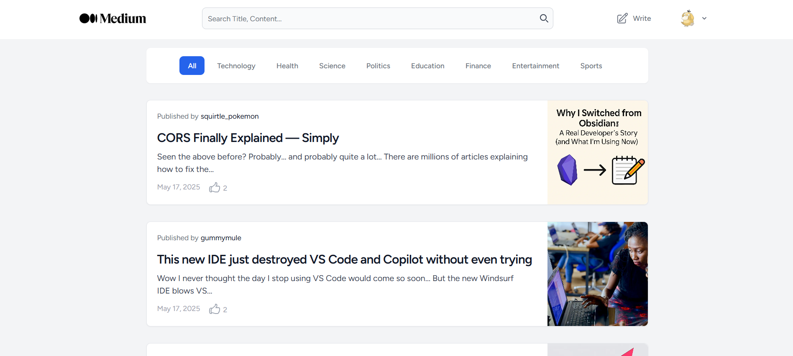

# 📝 Medium Clone (Laravel)

A full-featured Medium.com clone built with **Laravel**. This project replicates key functionalities of the popular blogging platform, including article creation, categorization, user authentication, and a sleek interface.



## 🚀 Features

- 🧾 Post articles with title, content, and images
- 🔐 User authentication and registration
- 📚 Category filtering (Technology, Health, Politics, etc.)
- 📅 Publish dates and like counts
- 🧭 Clean UI/UX mimicking Medium
- 🛠 Built with Laravel backend

## 🛠 Tech Stack

- **Backend**: Laravel 10+
- **Database**: MySQL
- **Frontend**: Blade / Tailwind CSS
- **Authentication**: Laravel Breeze

## 📸 Preview

> Home page displaying all articles categorized and styled like Medium.

## 📂 Setup Instructions

1. Clone the repo:
   ```bash
   git clone https://github.com/yourusername/medium-clone-laravel.git
   cd medium-clone-laravel
    ```
2. Install dependencies:
  ```bash
  composer install
  npm install && npm run dev
  ```
3. Setup environment
  ```bash
  cp .env.example .env
  php artisan key:generate
  ```
4. Configure your ```.env``` and run migrations:
  ```bash
  php artisan migrate --seed
  ```
5. Run the server
  ```bash
  php artisan serve
  ```
